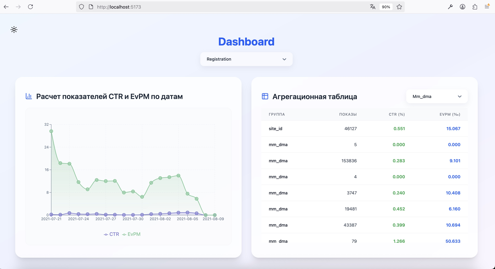
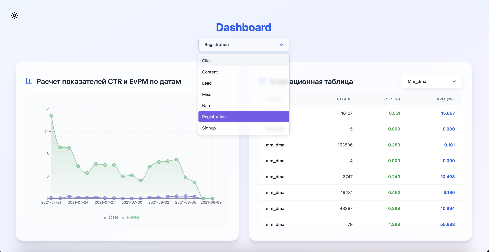
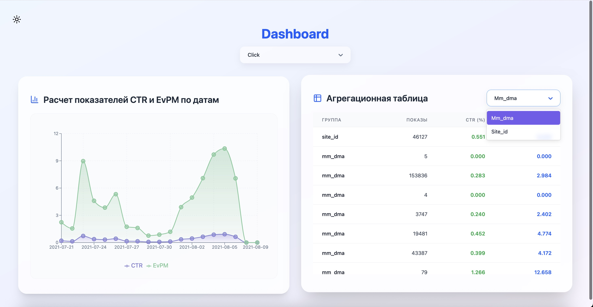
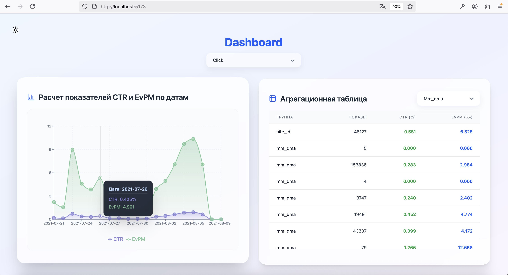
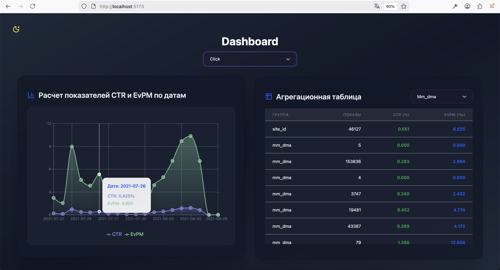
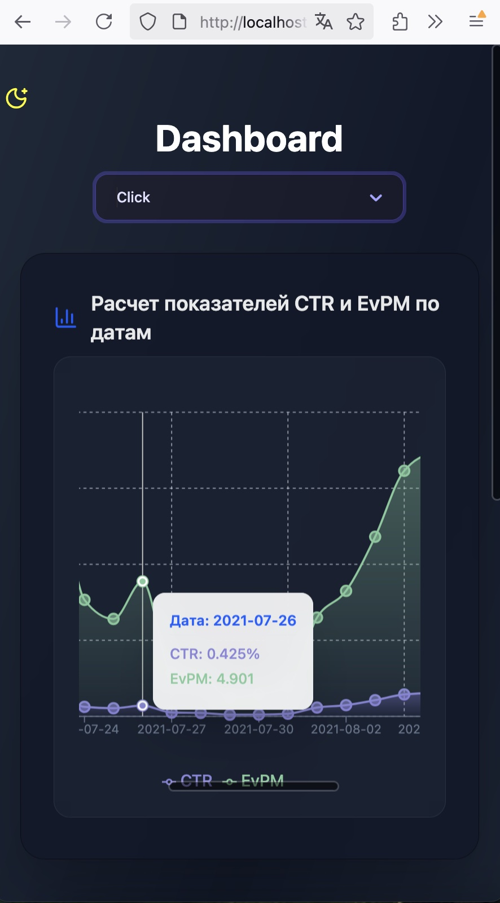

# Metric Track - Test Project

## Стек:

Frontend: React, React Context, React Select, Recharts, CSS, Tailwind, Lucide React, Axios

Backend: Python, Fast API, Pandas, Unicorn

## Установка

Клонируем репозиторий и устанавливаем зависимости:

```bash
git clone https://github.com/ianaomalova/TestMetricTrack.git
cd frontend
npm install

cd backend
python3 -m venv venv
source venv/bin/activate (для MacOS/ Linix)
venv\Scripts\activate (для Windows)
pip install fastapi uvicorn pandas

```

```
Также необходимо добавить файлы interview.X.csv и interview.Y.csv в папку data в папке backend
```

## Запуск проекта для разработки

```bash
npm run dev (frontend)
uvicorn main:app --reload (backend)
```

## Экраны

### Главная страница с графиком и таблицей



### Селект по типу события



### Селект для выбора группировки в таблице



### Тултипы на графике



### Темная тема



### Адаптив


